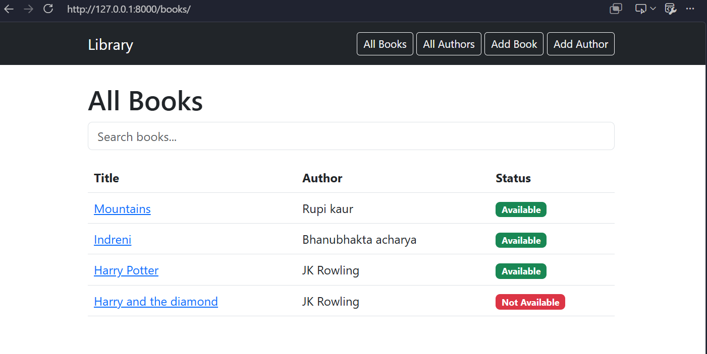
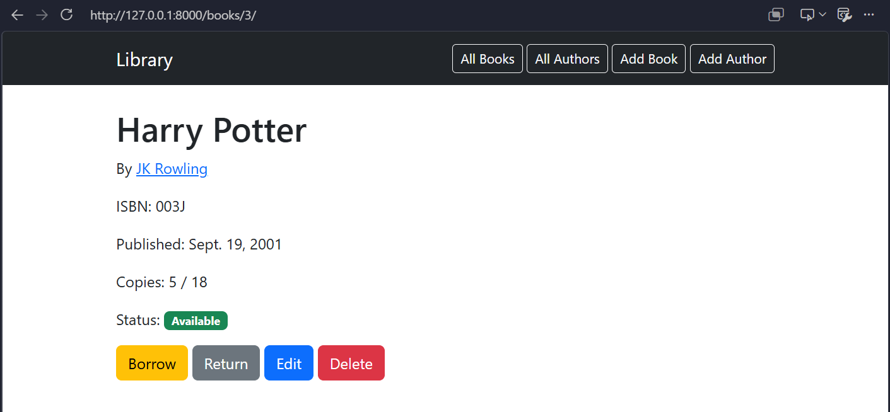
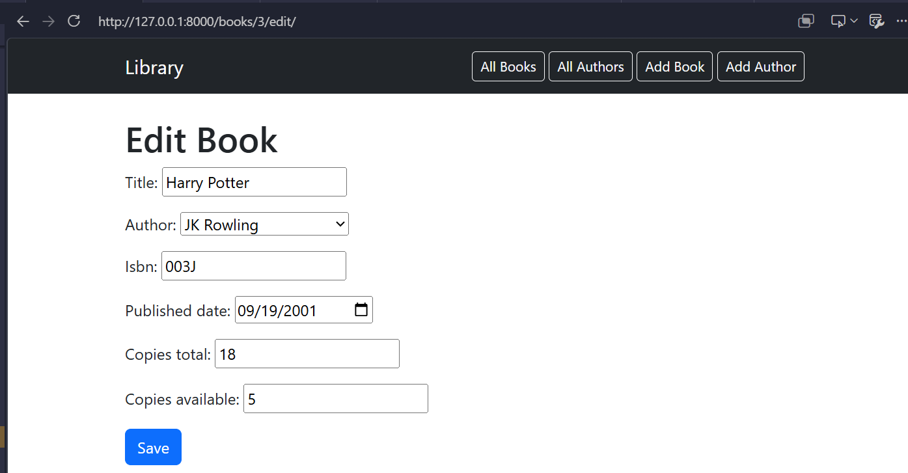

# Library Management System

## Description

A Django-based Library Management System that allows users to manage books and authors.

## Setup Instructions

1. Clone the repository

```
git clone https://github.com/sthashailaja/library-management-system.git
```

2. Open the project

```
cd library-management-system
```

3. Create a virtual environment

```
python -m venv venv
```

4. Activate it

Windows

```
venv\Scripts\activate
```

5. Install Django

```
pip install django
```

6. Run migrations

```
python manage.py migrate
```

7. Start the server

```
python manage.py runserver
```

Open:

```
http://127.0.0.1:8000/
```

---

## Features

- Home page
- Book CRUD
- Author CRUD
- Borrow book
- Return book
- Search books
- Bootstrap interface

---

## Bonus Features

- Search books by title
- Availability status badge

---


### Book List

### Book Detail


### Add/Edit Book

